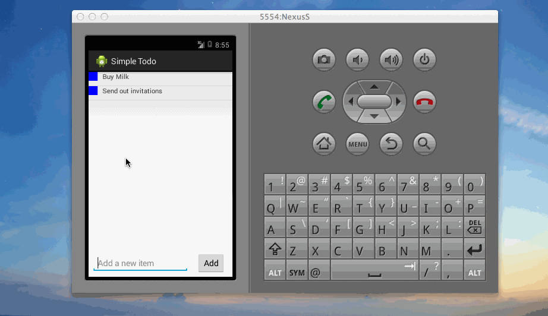

# Basic Todo App Demo

This is an Andriod demo application for keeping track of your todo list.
 See the [Andriod Bootcamp prework](https://gist.github.com/nesquena/843228e83fdc4f5ddc4e) for a step-by-step tutorial.

Time spent: 5 hours spent in total

Completed user stories:

 * [x] Required: Build initial todo app
 * [x] Required: Add edit functionality to todo app
 * [x] Add/Change Priority. The color of the square on main screen indicate level.
 * [x] Add/Remove Due date. Implemented via Date Dialog.
 * [x] Stylized list view. The color of square priority. The color of due date indicates urgency.
 * [x] Persistence using json.

Notes:
  Show toasts of action.
  Update color of stars in rating bar

GIF created with [LiceCap](http://www.cockos.com/licecap/).
